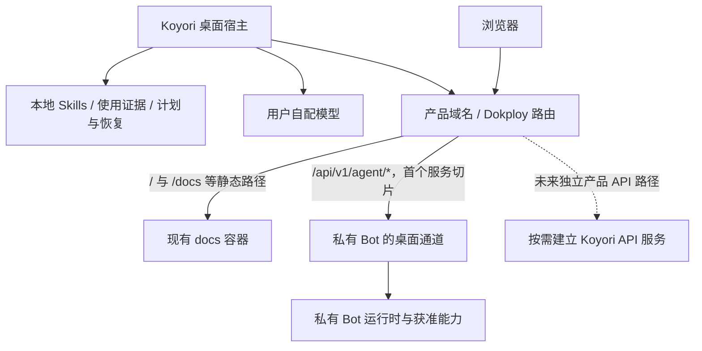

# Koyori 后端与统一域名方案

> 2026-09-22；根据统一域名和参考 cos-tool-bot 的要求收敛的设计草案。当前只部署文档站，本文中的后端、协议和路由均待实现与验收。

## 1. 目标与现状

产品域名同时承载官网和可选服务，桌面端仍可离线使用 Skills。后端参考 cos-tool-bot 的职责分层、Provider 配置与运行时分离、服务端授权和部署观测；本仓库只记录公开设计原则，不复制私有源码、配置或业务数据。

当前站点是静态产物：`apps/site/Dockerfile:16` 使用 Nginx，`apps/site/nginx.conf:12` 只查找静态文件；不是已运行的业务 API。`docs/design/personal-agent.md:53` 已把首个 Bot 通道定位为私有服务内的窄模块，`docs/design/personal-agent.md:78` 保留自配模型的基础 Agent。本文沿用这些边界。

**Goals**：同一域名按路径提供站点与 API；连接地址可配置；桌面与服务独立升级；首个真实服务流程具备身份、取消、重连、用量和故障语义。

**Non-Goals**：本轮不创建空后端或数据库，不新增云账号、支付、自动云同步、完整 Bot 管理后台或通用工具网关；不把本机 Skills、完整使用账本和会话日志默认上传，也不把现有管理 API 直接作为桌面 API。

## 2. 推荐架构

这里有两种复用：Koyori 自有后端借鉴工程架构；个人 Bot 接入通过窄协议复用已有服务能力。首个需求若只是个人 Bot 对话，在其服务内增加独立桌面通道即可。等 Koyori 有独立拥有的数据和业务，如可选云同步，再建立自己的 API 服务；不为转发一轮对话先增加一层常驻代理。

自有 API 优先采用以下技术与职责，实施时核对依赖版本、许可证并锁定：

| 层 | 建议 | 边界 |
| --- | --- | --- |
| HTTP 入口 | Node.js + Hono | 路由、认证、输入校验、错误映射；业务流程进入 service |
| 公共契约 | TypeScript + 运行时 schema 校验（Zod 候选） | 只含可公开请求、事件和结果；不依赖私有 server 类型 |
| 业务服务 | connection / session / run 按实际需求拆分 | 服务端验证身份、能力和归属，注入 Provider/Bot 适配器 |
| 持久化 | 需要独立远端状态时采用 Drizzle + PostgreSQL | 迁移、备份、所有者隔离；不迁移桌面文件权威来源 |
| 模型调用 | Provider 配置、模型目录、任务选择、运行时分离 | 每次任务开始时固定 Provider/Model 与非敏感配置版本，实际传播取消，未知用量不记成零 |
| 身份 | 管理端用户身份与桌面设备凭据分开 | 若自建用户后台，再评估 Better Auth；现有管理登录不能替代桌面授权 |

Hono 提供 Node.js 运行适配和基于类型的 RPC 客户端。RPC 可用于同版本、可共同发布的自有后台；独立升级的桌面仍需要公开协议版本和运行时校验，不能依靠编译期类型保证兼容。[Node.js 适配](https://hono.dev/docs/getting-started/nodejs)、[RPC 文档](https://hono.dev/docs/guides/rpc)。

Koyori 自有、可公开的 API 实现可在需要时放 `apps/api`；公共协议在有两个实际消费者时提取到 `packages/contracts`。涉及私人能力和服务端配置的实现保留在独立私有仓库。第一阶段不创建这些空目录，也不从桌面导入私有服务的 `AppType`。

## 3. 域名与部署

产品域名计划作为统一入口；部署参数使用 `serviceBaseUrl` 等显式配置，避免把个人部署地址固化为不可替换的协议。

| 路径 | 目标 | 状态 |
| --- | --- | --- |
| `/`、`/docs/*`、`/download/*`、`/changelog/*`、`/search/*` | 现有静态站点 | 已有站点实现 |
| `/api/v1/agent/*` | 私有服务的桌面专用路由 | 首个远端服务候选 |
| `/api/v1/` 下其他明确子路径 | 后续自有 API | 有实际需求时逐项登记 |

Dokploy 支持按 Host、Path 和 Container Port 路由。[官方域名配置](https://docs.dokploy.com/docs/core/domains)。后端原生接受约定前缀，优先不剥离路径；上线时检查生成的路由及优先级，确保 API 不落到静态站点，前缀相似的其他路径也不会误匹配。只转发桌面白名单路径，不能把私有服务整个 `/api` 或管理页挂到产品域名。

站点和 API 独立构建、健康检查、发布和回滚。正式站点 HTTPS 已验证；未来 API 仍需独立验证 TLS、认证与路由后才能启用携带凭据的连接。后端区分存活与就绪，返回可核对的部署版本和协议版本，不暴露内部配置。站点可用不代表 API 可用。

同一个入口服务器下增加路径路由通常不需要更改 DNS。未来迁移服务时可保持外部 URL；更换连接主机不能自动把已有凭据转发到新地址。

## 4. 首个服务切片：独立桌面会话

先完成“授权设备 → 创建会话 → 发起文字运行 → 读取增量 → 停止或恢复状态”。接口以 `/api/v1/agent` 为候选前缀，以下名称只用于设计，尚不可调用：

| 接口组 | 最小职责 |
| --- | --- |
| `pairings` / `connection` | 短时配对、由已登录用户确认、获取和撤销设备连接 |
| `capabilities` | 协议版本、获准能力及实际可用状态，不回传凭据 |
| `sessions` | 创建、继续、重命名、删除独立桌面会话；逐次核验归属 |
| `sessions/:id/runs` | 显式选择上下文后创建运行，携带幂等标识 |
| `runs/:id` / `runs/:id/events` / `runs/:id/cancel` | 查询状态、按游标读取事件、请求取消 |

新增运行的幂等标识绑定用户、设备、会话与请求摘要；相同标识和相同内容返回原运行，内容变化返回冲突。事件流只传公开文本增量、工具状态、操作提案和最终结果；不能直接转发现有管理/debug 流。桌面宿主持有设备凭据并读取流，renderer 通过窄 IPC 接收事件。

运行状态至少区分 `queued`、`running`、`cancelling`、`succeeded`、`failed`、`cancelled`、`interrupted`。取消请求已受理与实际停止分开；外部工具或计费结果无法确定时保留未知信息。重连按运行 ID 和游标续接，不自动再发创建请求；事件超出保留范围时返回可诊断错误并读取持久状态，不伪造重放成功。服务重启把无法继续的任务标为中断，不默认重跑有副作用的工具。

首版只允许文字回复、选定 Skills 摘要和少量白名单提案。远端提出本地写操作时，仍需本机生成计划、核对 revision、确认、保存恢复材料和回读；撤销设备或取消任务后旧提案失效。远端会话标识不能映射为客户端任填的 Telegram chatId；默认不读取群聊历史或向 Telegram 发消息。

Bot 通道如使用现有服务数据库，只新增其拥有的设备、会话和运行记录，通过迁移实现隔离；不让 Koyori 直接读 Bot 表。自有后端后续有独立数据时使用独立数据库权限。消息和用户确认的偏好是持久数据；事件投递缓存可有保留期限，但不能充当唯一会话记录。

## 5. Alternatives 与代价

| 方案 | 优点 | 代价与选择 |
| --- | --- | --- |
| 静态站 + 私有 Bot 窄通道；自有 API 按需求增加 | 利用已有运行能力，保持本地优先，部署边界清晰 | 首个通道随 Bot 服务发布，仍需新增身份、会话和协议适配；当前推荐 |
| 立即建立独立 Koyori API，再代理 Bot | 产品身份与生命周期可独立发展 | 增加认证传递、错误传播、部署和数据一致性成本；独立云业务出现时再采用 |
| 把站点、后台与 Bot 放进同一服务 | 部署数量少 | 文档可用性与私有服务发布绑定，公共贡献边界更复杂；当前不采用 |

SSE 可作为单向事件流的首选候选，消息创建和取消走 HTTP；仅在真正需要双向实时媒体时重新评估 WebSocket。框架相同不要求复制 Bot 的包结构、全部依赖、组织权限体系或工具全集。

## 6. 验收、上线与回滚

1. 用合成服务验证桌面连接、流式文本、取消、重连、未知用量、协议不兼容与离线状态；本地 Skills 始终可用。
2. 在私有服务的隔离环境实现配对与独立会话，验证跨用户/设备/会话拒绝、撤权后续请求和现有流关闭、幂等冲突、进程重启与事件过期；默认不接生产账号或付费 Provider。
3. 增加新表前备份并演练恢复，采用增量迁移；服务回滚关闭新通道，保留设备/会话/运行记录，不以删除数据库回滚。
4. 配置正式域名与 API 路由后，分别检查匿名文档、API JSON 404、鉴权拒绝、HTTPS、流式及时到达、取消及断线恢复；确认管理路由没有被带出。反向代理的缓冲和超时须真实验证。
5. 记录服务 commit、协议版本、客户端版本和测试范围；真实 Bot 调用单独验收。关闭桌面通道后保留静态站与本地能力，客户端提示服务不可用，不自动切到另一 Provider。

日志记录请求 ID、运行状态、耗时与可得用量，过滤凭据、原始上下文和私有工具参数；设置请求大小、并发和超时限制。遥测、收费与大规模基础设施不作为首个切片的前置条件。

## 7. 后续顺序与待决问题

先在 Koyori 完成公共契约、合成连接和基础文字流程；再在私有 Bot 项目实现设备通道；最后验证正式域名下的真实连接。只有独立云业务出现时，才建立自有 API 和相应数据库。Provider 细节继续以 [参考适配](cos-tool-bot-reference.md) 为准，角色、操作卡和记忆见 [个人 Agent](personal-agent.md)。

实施前收敛首个模型协议和桌面会话保留策略；语音深度、跨渠道记忆共享与首个额外远端工具仍是待决范围。这些不影响先做文字、独立会话和撤销能力。具体存储 schema、事件保留量和凭据生命周期在对应实现方案中确定，不将候选参数当作既有保证。
