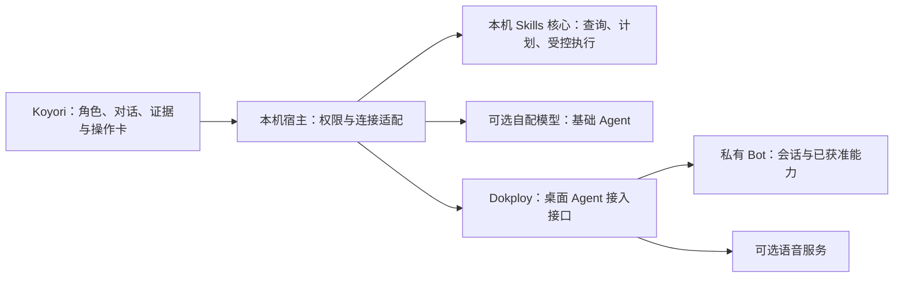

# Koyori 个人 Agent 与 Bot 接入草案

> 2026-09-22；本地自配模型文字 Agent 已进入开发版；从 Skills 资源清单生成单项、按需、可编辑的摘要讨论已实现；本轮交付证据见 [PR #5](https://github.com/yusixian/koyori/pull/5)。个人 Bot 远端接入、操作卡和语音仍是候选阶段。本文不复制 Bot 代码、修改服务器或部署任何服务。

## 1. 用户想要的体验

当前开发版先提供本地自配模型的文字 Agent：本地保存会话，用户选择连接后手动发送文字，查看流式回复、取消和明确的失败/未知状态。它不自动读取或附加 Skills、账本、日志，也没有本机写入工具。

本轮按需摘要限定为一项 Skill：从资源清单选择一项并和 Koyori 讨论，主进程按选定观察窗口生成白名单摘要预览，包含名称、客户端、观察窗口、次数及证据缺口、保留/复查状态和规则类型。用户审阅后将摘要加入当前可编辑草稿，再手动发送；已有草稿追加保留，加入前可丢弃摘要，加入后可在草稿中删除。准备摘要不自动请求模型，也不发送 Skill 正文、描述、路径、原始会话或其他资源信息。名称可能私密，用户应在发送前审阅。

统计摘要使用生成时的快照，不随账本自动变化；未知、同名待归属和暂停状态仍需解释。当前不支持多选、全文附件或证据引用跳转，整理建议没有操作卡和执行权限。

本地操作卡现支持选定 Skill 的“始终保留”和“30 天后复查”：由用户点选动作，宿主生成当前偏好与结果预览，确认时重新核对资源、来源和偏好，五分钟过期。模型文字不会生成执行参数或授权。撤销受管部署仍属后续范围。

候选远端阶段才讨论个人 Bot 的设备配对、远端会话、获准能力、操作卡和语音。它们不属于当前本地文字或按需摘要阶段，也不代表已有可调用 endpoint。

创新优先放在三处可体验的联系：

- **对话跟着工作走（候选方向）**：从资源详情进入讨论；当前按需摘要只保留名称、观察窗口和统计缺口，暂不提供证据引用跳转。未来若增加引用，仍需明确回到原处，且不会后台读取所有项目。
- **记忆看得见**：首版保存用户明确确认的少量偏好，允许查看、修改和遗忘；区分当前对话、长期偏好与 Bot 远端记忆。不会默认合并 Telegram 群聊历史。
- **表达有角色，动作有依据**：用现有角色资产呈现空闲、回复中、等待操作、错误等真实状态。语音开启时提供自然停顿、固定声音和停止播放；情绪表现不能替代能力或执行状态。

这三个方向是设计建议，不声称 CosyVoice 或 ChatTTS 自带记忆、工具执行或完整 Agent。

## 2. CosyVoice / ChatTTS 的参考边界

2026-09-22 查阅官方仓库：[CosyVoice](https://github.com/QwenAudio/CosyVoice) 侧重语音生成、流式输入输出和可控表达；[ChatTTS](https://github.com/2noise/ChatTTS) 侧重对话式语音、停顿和韵律。适合借鉴说话体验，Agent 的记忆与工具协作需要另做设计。

语音有三个不同的首版边界，不能用“语音 Agent”混在一起承诺：

| 候选 | 用户体验 | 额外成本 |
| --- | --- | --- |
| A：文字与角色先行 | 有个性、连续对话、透明记忆、操作卡 | 不需要音频链路 |
| B：文字 + 按需朗读（建议起点，待确认） | 完整文字回复始终可读，可朗读、停止；固定声音 | 一个可替换 TTS 接口、音频播放与取消验证 |
| C：语音对话 | 按键说话 / 识别 / 回复 / 打断播放 | 另需 ASR、麦克风权限、端到端取消和延迟验收；全双工又是进一步范围 |

首版不预装大模型、不下载语音权重、不做声音克隆或常开麦克风。若用户选择 C，应同步调整工作量和验收，不能只加一个话筒图标。

许可也分代码与权重：[ChatTTS 官方说明](https://github.com/2noise/ChatTTS#licenses) 当前列出代码 AGPLv3+、模型 CC BY-NC 4.0；不能把它直接当作未来商业发行的默认模型。[CosyVoice LICENSE](https://github.com/QwenAudio/CosyVoice/blob/main/LICENSE) 为 Apache-2.0，具体权重、依赖与所用声音仍分别核对。本方案先借鉴体验，未选定或引入任何语音代码与模型；远程调用不自动消除所用组件的许可要求。

## 3. 现有服务的接入判断

已有服务具备管理、运行状态和流式事件等基础，但管理端接口不能直接等同于完整桌面 Agent。接入需要独立的桌面身份、会话、能力授权与投递适配。

本仓库只定义公开连接契约和合成测试服务，不保存参考私有仓库的提交、内部路径或实现。是否能复用具体模块由其所属项目独立评估；未核验生产行为。

## 4. 推荐：公开桌面端 + 私有服务端能力

这里“接入接口”首先是 Bot 服务内的窄模块，不先增加一个独立部署的网关产品。服务继续由 Dokploy 管理；Koyori 不持有 Dokploy 部署权限或服务端 Provider 主密钥。

统一域名下的路由、后端选型和分阶段部署见 [后端方案](backend.md)。首个桌面通道候选路径为 `/api/v1/agent/*`；它与文档站独立部署。Koyori 将来出现独立云业务时，再建立自己的 API 服务；参考 Bot 架构和调用 Bot 能力分别处理。

| 放在哪里 | 内容 |
| --- | --- |
| Koyori 开源仓库与安装包 | 自己的 UI、桌面权限检查、Skills 核心、公开连接契约、Bot 适配器、合成 fake server、第三方声明 |
| cos-tool-bot 私有仓库与服务器 | 现有业务实现、Provider 凭据、私人配置/提示词/数据，以及用户不想公开的生图实现 |
| 经审阅后可单独提取 | 无私有依赖的通用类型或工具函数；按文件列来源、许可、依赖，不默认整包发布 |

**目前仅确认生图不能暴露；“其他可能可公开”不是已完成的公开许可清单。** 第一阶段不复制任何 Bot 源码到 Koyori，也不把 Bot 作为桌面打包依赖。远端返回公开化的能力/结果，过滤内部路径、提示词、原始工具参数和错误堆栈。公开说明与 fixture 也不能包含私有源码或配置片段。

生图暂不进入首版桌面能力白名单。以后用户若希望桌面能用生图，可以只开放远程任务接口，代码仍留服务器；代码是否开源与功能是否可调用分别决定。隐藏前端按钮不构成服务端保护。

## 5. 分阶段 Agent 接口边界

本地文字阶段已进入开发版：支持自配 OpenAI-compatible Chat Completions 连接、本地会话新建/切换/改名/删除、流式文字、取消、失败/中断状态和未知用量。连接凭据进入系统安全存储，启动或浏览会话不访问钥匙串，仅在主动保存或使用密钥时访问。

单 Skill 按需摘要的当前契约是：

- 从资源清单选择一项 Skill，由主进程生成当前观察窗口的白名单摘要预览。
- 摘要只含名称、客户端、观察窗口、次数及证据缺口、保留/复查状态和规则类型；不含正文、描述、路径、原始会话或其他资源信息。
- 用户审阅后把摘要追加到当前可编辑草稿，之后手动发送；准备摘要不自动请求，加入前可丢弃摘要，加入后可编辑草稿。统计快照不自动改写已生成草稿。
- 未知、同名待归属和暂停状态保留解释；当前不支持多选、全文附件或证据引用跳转，建议不授予操作卡或执行权限。

以下为候选远端能力契约，不是已存在的 endpoint：

- 连接 / 撤销、获准能力列表与协议版本。
- 建立独立桌面会话、发送消息、读取消息/运行状态、取消生成、按游标续接事件。
- 事件仅含文本增量、公开工具状态、操作提案、完成/错误和可得的用量；不转发原始 debug 事件或内部 reasoning。
- 若未来扩大远端上下文，仍需逐次选择并显示将发送内容；当前按需摘要阶段只发送上述白名单摘要，Skill 全文、日志、密钥和全盘读取不作为普通工具开放。
- 远端可提出类型化操作卡；主进程只接受白名单能力，绑定当前会话、目标、参数摘要、版本与授权期限，重新验证本地计划后执行。任意 shell / 路径字符串不是协议能力。
- 本地操作结果只回传必要状态；批准一次操作不授权同类未来操作。取消或撤销后，旧提案不能继续执行。

本地文字阶段的最小会话能力为创建/继续/重命名/删除，保存消息与状态、停止生成、明确错误重试。没有会话树、多 Agent 调度、终端、任意 MCP 安装或常驻自主任务。单 Skill 讨论复用同一会话与连接边界。

公开用户当前可自配模型协议使用本地文字 Agent；个人连接 cos-tool-bot 后启用服务器能力仍是候选远端阶段。两种连接共享界面契约，不维护两套完整产品：本地阶段只做文字与按需摘要，不复制 Bot 的工具全集。切换连接新建会话，提示数据去向，不静默迁移历史或在错误时自动切服务。

## 6. 鉴权、会话与记忆

自用也不使用内置万能 token。建议新增设备配对：用户在已登录的 Bot 管理端确认 Koyori 的短时配对请求及能力范围，服务器发放可撤销的设备凭据；桌面凭据放系统安全存储。配对码单次使用且过期，服务端绑定用户、设备、能力和指定 Bot；每个请求校验会话归属。此流程尚未实现，需要在 Bot 范围内设计和验证，不假设现有登录接口已支持。

桌面使用独立会话标识，不能由客户端填任意 Telegram chatId 来读取会话。历史恢复必须校验所属主体；断线重连只恢复同一个运行，不自动重发创建请求。发送请求使用幂等标识，避免重复计费/执行。

短期对话由所选运行端保存；需要本地缓存时界面说明位置和保留策略。首版长期记忆只做用户明确保存的偏好，并保留来源与作用域；云端记忆的查看/修改/删除须有对应接口。断开连接不声称已删除服务器记录；删除会话也不默认为删除单独保存的长期记忆。跨 Telegram/桌面记忆共享另行选择，不作为默认“无缝同步”。

文本 Agent 与语音连接可以不同，发送前应说明语音服务也会收到回复文本。取消停止本地播放并请求取消远端生成；界面不得承诺取消一定撤回已发生的费用。离线时本地 Skills 仍可用，Agent 显示不可达而非伪造答复。

## 7. 备选方案与取舍

| 方案 | 优点 | 代价 / 判断 |
| --- | --- | --- |
| 原生 Agent UI + Bot 窄接口（推荐） | 保留私有能力，能和本地 Skills 融合，便于日后替换后端 | 需新增身份/会话与权限适配，首版最明显的研发风险 |
| 嵌入现有 Bot 管理界面 | 较快提供熟悉的后台入口 | 管理页与 Agent 交互不同；保留为“打开管理后台”，不作为 Agent 完成标准 |
| 先提取开源 Bot 引擎 | 社区可独立部署完整引擎 | 必须审查跨包依赖、私人业务和许可，第一版成本过高；以后按模块进行 |

## 8. 实施验证与退出条件

1. 本地文字阶段使用合成服务验证协议、流式回复、取消和故障；这不算真实付费 Provider 或 Bot 接入完成。
2. 按需摘要阶段验证单 Skill 选择、白名单字段、统计快照、草稿追加/取消、手动发送和敏感字段排除；当前交付证据见 PR #5。
3. 在 Bot 的隔离开发环境跑通配对、独立桌面会话、至少一项获准的服务器能力；无意外 Telegram 发送，不扩大现有后台权限。
4. 验证跨用户/跨会话拒绝、设备撤销、重复发送、断线续流、取消、未知用量和私有字段过滤。合成 payload 用明显假数据。
5. 后续跑通“选定 Skills → Agent 解释 → 操作卡 → 本地确认与 revision 检查 → 撤销/恢复”。本地受控操作不依赖 Bot 通道，远端能力另行授权；文字建议不等于操作集成完成。
6. 语音若纳入，补播放顺序、停止后旧音频不续播、服务错误和选定目标设备实测。语音许可/算力未具备时不能把该项勾为完成。
7. 外部条件未具备时保留未完成项，或请用户审阅调整里程碑；不能用 mock 替代真实首版承诺。

失败回退以独立连接为单位：可撤销 Bot 连接，保留本机 Skills；服务端关闭桌面通道不影响原 Telegram 入口。协议拒绝不兼容版本并说明升级方式。先做窄接口，不为未知未来建立多代兼容平台。

待用户选择：语音在首版到 A/B/C 哪一级；第一项远端能力用什么；允许共享哪些明确的个人偏好。未回答前，以文字主流程继续规划，语音和跨渠道记忆保持候选，本阶段先完成已批准的工程起点；语音与跨渠道记忆不隐式加入实现。
